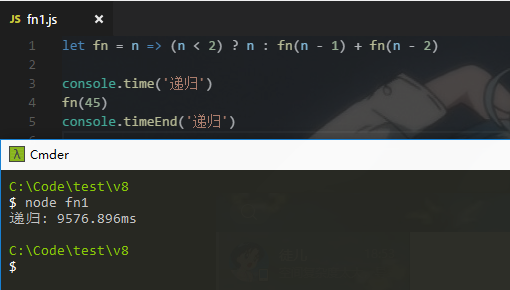
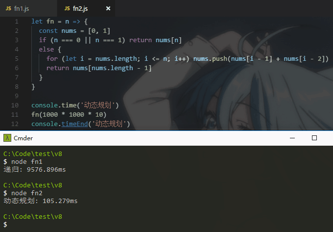
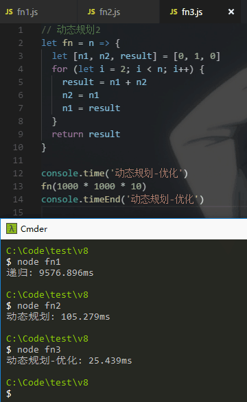

# 斐波那契数列
## 简介
`斐波那契数列`：这个数列从第3项开始，每一项都等于前两项之和。
例如 0, 1, 1, 2, 3, 5, 8, 13, 21, ...
本文的例子就是通过`斐波那契数列`进行说明
## 递归实现
我们通过递归来实现 `斐波那契数列`
```javascript
// 递归
let fn = n => (n < 2) ? n : fn(n - 1) + fn(n - 2)

console.time('递归')
fn(45)
console.timeEnd('递归')
```
这个写法的人应该不少，然后我们运行看看时间



结果发现，居然需要9s！简直不能忍，这才求的第45位啊！再回去看代码，发现每个函数执行后分为两个函数，然后一直分下去，造成了很大的空间复杂度，同时时间复杂度也变得很大。

## 动态规划实现
我们通过动态规划来实现 `斐波那契数列`
```javascript
// 动态规划
let fn = n => {
  const nums = [0, 1]
  if (n === 0 || n === 1) return nums[n]
  else {
    for (let i = nums.length; i <= n; i++) nums.push(nums[i - 1] + nums[i - 2])
    return nums[nums.length - 1]
  }
}

console.time('动态规划')
fn(1000 * 1000 * 10)
console.timeEnd('动态规划')
```
这个思路很简单，数组和数列很相似，我们计算出每个数列的值，把值都保存到数组，然后输出最后一位  



结果发现，第1亿的数的值居然才消耗0.1s，这个相比递归的方法，简直快了不知道多少倍，但是我们发现，我们储存的数据明明只需要数组的最后一位，为啥要保存整个数组呢？

## 动态规划的优化
对上面的动态规划方案进行优化
```javascript
// 动态规划2
let fn = n => {
  let [n1, n2, result] = [0, 1, 0]
  for (let i = 2; i < n; i++) {
    result = n1 + n2
    n2 = n1
    n1 = result
  }
  return result
}

console.time('动态规划-优化')
fn(1000 * 1000 * 10)
console.timeEnd('动态规划-优化')
```
既然最后一位的值只需要前两位，那么我们只要保存第n-1和第n-2的数就可以了



结果发现，这快了太多了！只消耗了四分之一的时间！我们可以想想，为啥使用数组这么耗时呢？  
数组在内存上储存是连续的一段，不是随机插入值，那么速度必然受到影响，而且优化后只需要修改变量，那优化的速度确实可以提升不少。  
这可以结合到链表，链表是随机插入值，所以链表在添加数据的时候比数组快。

## End
递归确实不能随意使用，不仅不注意容易爆栈，而且消耗的空间复杂度也会比较大，可能会带来更大的时间复杂度。  
当然递归也是可以优化的，可以去阅读一下尾递归和尾递归优化的文章。

作者：微博 [@itagn][1] - Github [@itagn][2]

[1]: https://weibo.com/p/1005053782707172
[2]: https://github.com/itagn
