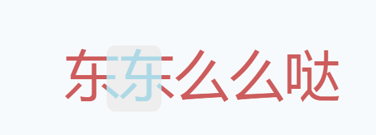

# 像滤镜一样改变字体颜色
标题是什么意思？可能一开始觉得怪怪的，字体颜色不就是一个css的样式就改变了吗？    
css样式是改变整个字体的颜色，但是怎么改变半个甚至`0.3333...`个字体的颜色呢？    
先看看效果，[预览网址](https://itagn.github.io/ui/fontRun/)        
    

CodePen地址：[https://codepen.io/itagn/pen/aaPjym](https://codepen.io/itagn/pen/aaPjym)
## 从零开始
html
```html
<div class="box">
  <div class="down">东东么么哒</div>
  <div class="up">东东么么哒</div>
</div>
```
css
```css
.box {
  position: absolute;
  top: 50%;
  left: 50%;
  transform: translate(-50%, -50%);
  -webkit-transform: translate(-50%, -50%);
  font-size: 5em;
  width: 5em;
  height: 1.2em;
}
```
这里涉及到两个div了，一个红豆色的div和一个浅蓝色的div，而且内容都是"东东么么哒"    
而且它们需要完全重合，包括文字内容，字体大小，位置等等    
这里就涉及到层级问题了    

    第一个关键属性 z-index: n    

```css
.up, .down {
  position: absolute;
  height: 100%;
  line-height: 1;
}
.up {
   z-index: 2; 
}
.down {
  z-index: 1;
}
```
视觉分析来看

    是滑动的的div设置了半透明，颜色结合的部分改变的颜色？

不对，滑动的div颜色是浅灰色，底色是红豆色，是不能结合成浅蓝色的    
不是颜色的结合，那么肯定是自定义的颜色，那就是说浅蓝色的文字本身就在滑动的div上面    
如果div上面的字要显示成图里面这样，那么必然是通过切割出来的    

    第二个关键属性 overflow: hidden;   

.up的div处理成滑块
```css
.up {
  width: 1em;
  z-index: 2;
  overflow: hidden;
  border-radius: 15%;
  background: #eee;
  color: lightblue;
}
.down {
  color: indianred;
}
```
这个时候回想一下轮播图，是不是轮播图也实现了类似的效果，ok，继续往下    
轮播图滚动的是图片序列，我们反过来理解，滚动“窗口”    
那么我们通过animation来制作动画，通过改变left的值实现窗口的滚动

    第三个关键属性 animation

```css
.up {
  animation: run 2.5s infinite;
  -webkit-animation: run 2.5s infinite;
}
@keyframes run {
  0% { left: -1em; }
  100% { left: 5em; }
}
@-webkit-keyframes run {
  0% { left: -1em; }
  100% { left: 5em; }
}
```
然而我们发现一个div好像解决不了，因为窗口需要一个空白div，文字内容需要新的div    
其实一个div可以解决，我们通过伪元素after或者伪元素before就能构造    

    第四个关键属性 ::before || ::after

html结构变化
```html
<div class="box">
  <div class="down">东东么么哒</div>
  <div class="up"></div>
</div>
```
css变化，.up的div只做滑块
```css
.up::before {
  content: "东东么么哒";
  color: lightblue;
  position: absolute;
  width: 5em;
}
```
可是窗口在滚动也会影响伪元素的位置！    
既然这样，那么我们给伪元素也来和窗口运动刚刚相反的动画吧，这样相对浏览器不就是静止了吗...    

```css
.up::before {
  animation: run2 2.5s infinite;
  -webkit-animation: run2 2.5s infinite;
}
@keyframes run2 {
  0% { left: 1em; }
  100% { left: -5em; }
}
@-webkit-keyframes run2 {
  0% { left: 1em; }
  100% { left: -5em; }
}
```
以上不需要用到JavaScript，材料准备完毕！

## 可维护的优化

CodePen地址：[优化后的代码](https://codepen.io/itagn/pen/dqgEdv)    

列举需要优化的点：

> * 伪元素content的值与.down的div文字的DRY问题
> * 如何通过JavaScript调整展示的整体大小
> * css里面反复出现的相同的值，这样不够DRY
> * 滑块的运动轨迹一直有效处于文字的上面（即下次更换文字内容的时候，不需要更换滑动结束时候的left值）

我们发现，不能通过JavaScript来改变伪元素的content    
如果能通过修改JavaScript变量就能改变div的文字和伪元素的文字，那就好了！    

答案是可以的，css通过var()可以获取css变量，通过`--属性`可以设置css变量，那么我们把所有变量挂载到根属性 `:root` 上面，就可以获取了    

而且浏览器里面可以发现    
```javascript
document.querySelector(':root') === document.documentElement // true
```
说明这里就是html的根属性，接下来通过 `document.documentElement.style.setProperty('--属性', 值)`既可以保证代码的可维护性，然后我们把css代码通过变量优化起来，全部导入到JavaScript的对象里，尽量做到DRY! 

作者：微博 [@itagn][1] - Github [@itagn][2]

[1]: https://weibo.com/p/1005053782707172
[2]: https://github.com/itagn
