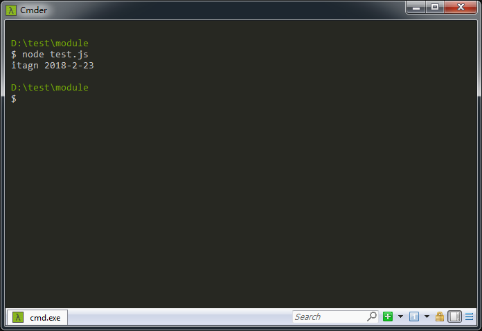
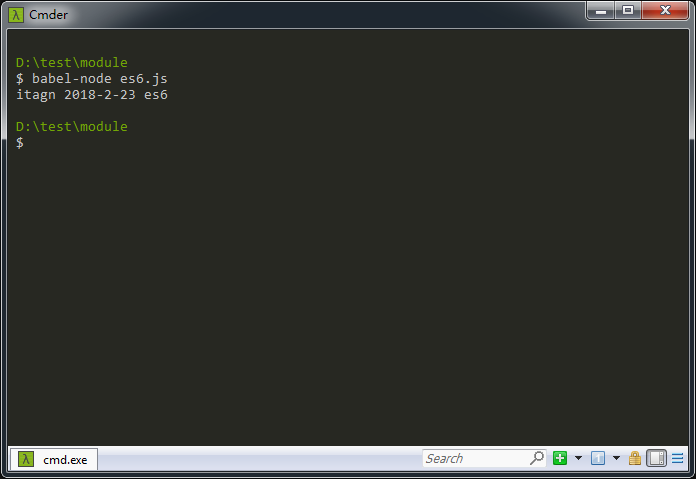
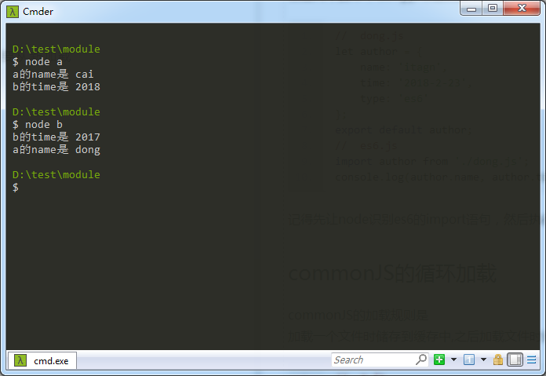
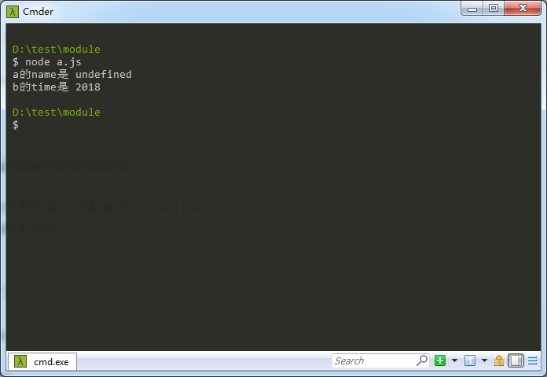
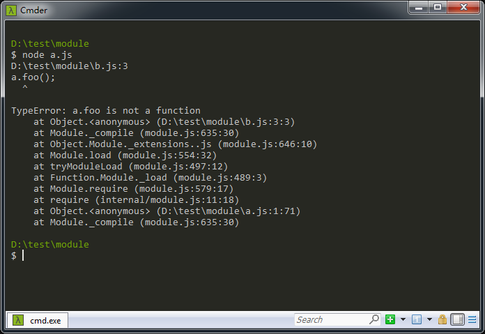
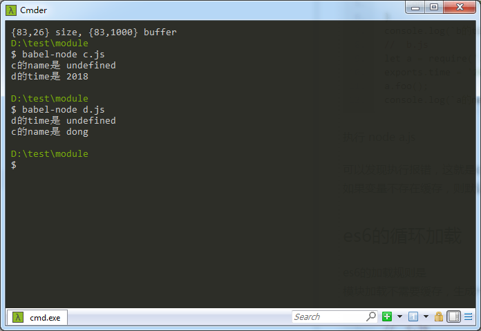
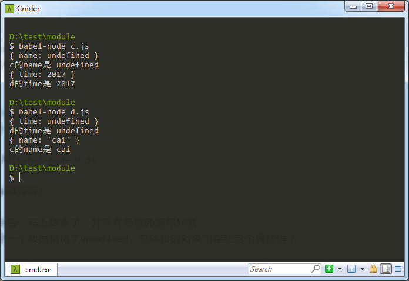
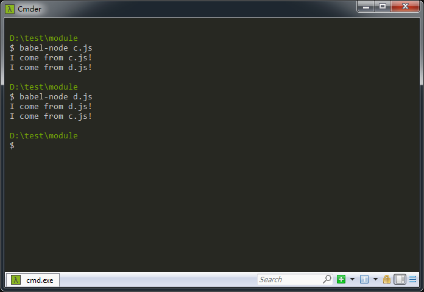

# JavaScript模块的循环加载
如果设置了两个js文件互相加载，那么是不是会死循环下去呢？  
这个问题来源于[【饿了么的Node面试题】](https://elemefe.github.io/node-interview/#/sections/zh-cn/)   
本文讨论最流行的commonJS和es6的模块加载问题  
看了阮一峰的 [JavaScript 模块的循环加载](http://www.ruanyifeng.com/blog/2015/11/circular-dependency.html) 有感
## nodejs和es6的模块化加载
JavaScript模块化规范

1. NodeJS的commonJS规范
1. requireJS的AMD规范
1. seaJS的CMD规范
1. es6的模块化规范

本文主要讨论commonJS和es6的模块化的循环加载，先看看两者有啥区别  

**commonJS**加载和导出  
创建两个脚本，cai.js导出变量，test.js加载变量并输出
```javascript
//  cai.js
let author = {
    name: 'itagn',
    time: '2018-2-23'
};
module.exports = author;
//  test.js
let author = require('./cai.js');
console.log(author.name, author.time);
```
执行 node test.js  



**es6**的加载和导出
创建两个脚本，dong.js导出变量，es6.js加载变量并输出
```javascript
//  dong.js
let author = {
    name: 'itagn',
    time: '2018-2-23',
    type: 'es6'
};
export default author;
//  es6.js
import author from './dong.js';
console.log(author.name, author.time, author.type);
```
记得先让node识别es6的import语句，然后执行 babel-node es6.js  



## commonJS的循环加载
commonJS的加载规则是  
加载一个文件时储存到缓存中,之后加载文件时从缓存中获取数据，而不需要从新加载  
```javascript
//  a.js
exports.name = 'cai';
let b = require('./b.js');
exports.name = 'dong';
console.log(`b的time是 ${b.time}`);
//  b.js
exports.time = 2017;
let a = require('./a.js');
exports.time = 2018;
console.log(`a的name是 ${a.name}`);
```
分别执行 node a.js 和 node b.js



可以发现执行node命令后，马上结束了，并没有导致死循环加载  
但是两次脚本输出的结果都不是文件最后的结果 dong和2018  

解析一下执行 node a.js 的顺序  

1. 读取a.js第一行，给a的exports添加属性name为cai，保存到缓存中
1. 读取a.js第二行，加载b.js，执行线程执行b.js，停止执行a.js
1. 读取b.js第一行，给b的exports添加属性time为2017，保存到缓存中  
1. 读取b.js第二行，根据commonJS的加载规则，**不需要重复执行a.js，从缓存读取a.js的数据**，a.name为cai
1. 读取b.js第三行，给b的exports修改属性time为2018，保存到缓存中
1. 读取b.js第四行，**缓存中获取a.name为cai**，输出'a的name是 cai'，b.js执行完毕
1. 读取a.js第三行，给a的exports修改属性name为dong，保存到缓存中
1. 读取a.js第四行，**缓存中获取b.time为2018**，输出'b的time是 2018'，a.js执行完毕

和输出的结果一致，虽然不会导致加载死循环，但是还是存在一些问题  
我们可以发现，a.js执行到第二行的时候，去执行b.js了，如果加载b.js放在第一行呢，这个时候a.js没有数据写入缓存中，那么b.js会报错吗？
```javascript
//  a.js
let b = require('./b.js');
exports.name = 'dong';
console.log(`b的time是 ${b.time}`);
//  b.js
let a = require('./a.js');
exports.time = 2018;
console.log(`a的name是 ${a.name}`);
```
执行 node a.js



从缓存读取不存在的数据时没有报错，而是输出了undefined  
如果从缓存读取不存在的函数方法呢？
```javascript
//  a.js
let b = require('./b.js');
exports.name = 'dong';
exports.foo = function (){
    console.log('a');
}
console.log(`b的time是 ${b.time}`);
//  b.js
let a = require('./a.js');
exports.time = 2018;
a.foo();
console.log(`a的name是 ${a.name}`);
```
执行 node a.js



可以发现执行报错，这就是commonJS规范加载存在的问题，需要我们避免。  
如果变量不存在缓存，则对象没有这个属性，输出undefined，不存在的引用会报错。  
## es6的循环加载
es6的加载规则是  
模块加载不需要缓存，不会去执行模块，而是只生成一个动态的只读引用，等需要使用时，则根据引用去获取数据  
```javascript
//  c.js
export let name = 'cai';
import * as d from './d.js';
console.log(`d的time是 ${d.time}`);
//  d.js
export let time = 2017;
import * as c from './c.js';
console.log(`c的name是 ${c.name}`);
```
分别执行 babel-node c.js 和 babel-node d.js



可以发现执行babel-node命令后，马上结束了，并没有导致死循环加载  
解析一下执行 babel-node c.js 的顺序 

1. 读取c.js第一行，给c的exports添加属性name为cai 
1. 读取c.js第二行，生成d.js的引用，不去执行d.js
1. 读取c.js第三行，**根据引用获取d.time为2017**，输出'd的time是 2017'，c.js执行完毕
1. 读取d.js第一行，引用触发d.js，给d的exports添加属性time为2017，返回数据 
1. 读取d.js第二行，生成c.js的引用，不去执行c.js
1. 读取d.js第三行，**根据引用获取c.name不是函数，丢失引用，找不到数据（个人认为）**，输出'c的name是 undefined'，d.js执行完毕  

发现了一个问题，循环引用的数据输出了undefined，是输出的对象不存在这个属性吗？
```javascript
//  c.js
export let name = 'cai';
import * as d from './d.js';
console.log(d);
console.log(`d的time是 ${d.time}`);
//  d.js
export let time = 2017;
import * as c from './c.js';
console.log(c);
console.log(`c的name是 ${c.name}`);
```
分别执行 babel-node c.js 和 babel-node d.js



我们发现输出的对象包含了这个属性，但是为啥值为undefined呢？难道引用丢失了么？  
我们可以传递函数看看
```javascript
//  c.js
export function cfn() {
    console.log('I come from c.js!');
};
import * as d from './d.js';
d.dfn();
//  d.js
export function dfn() {
    console.log('I come from d.js!');
};
import * as c from './c.js';
c.cfn();
```
分别执行 babel-node c.js 和 babel-node d.js



可以发现传递函数之后，全部正确的输出，因为函数名作为函数的指针，可以最终找到这个函数的地址  
针对import找不到数据的问题，个人认为应该是引用丢失了，但是属性仍然是存在的  

## 总结
循环引用在平时的项目开发中经常遇到，个人建议把可能导致循环引用的变量或者函数，提出到一个新的js文件，不管是commonJS还是es6在处理循环加载时都存在问题，应该避免这种问题。

作者：微博 [@itagn][1] - Github [@itagn][2]

[1]: https://weibo.com/p/1005053782707172
[2]: https://github.com/itagn


