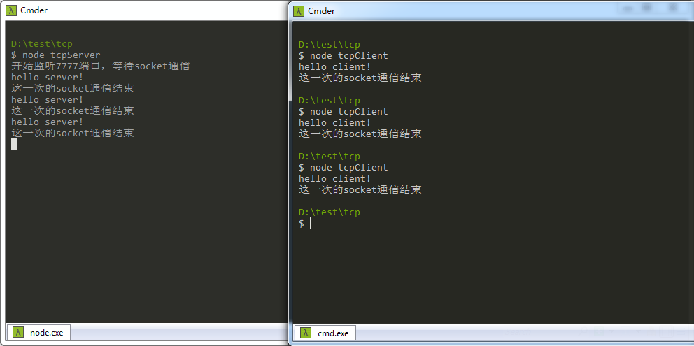
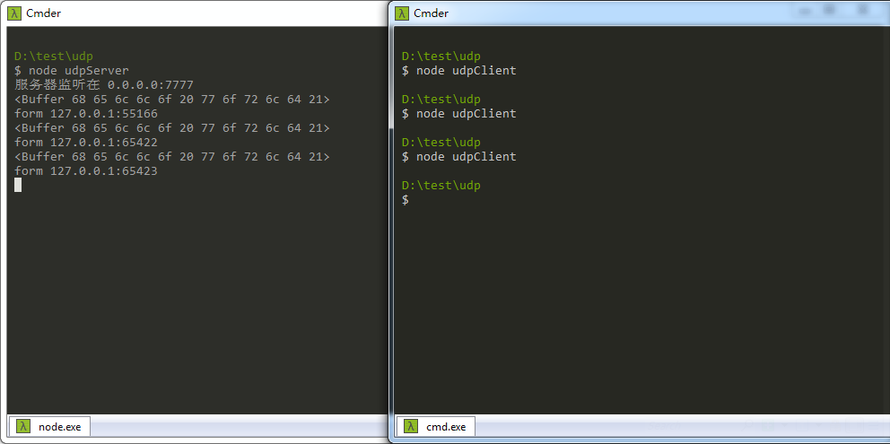
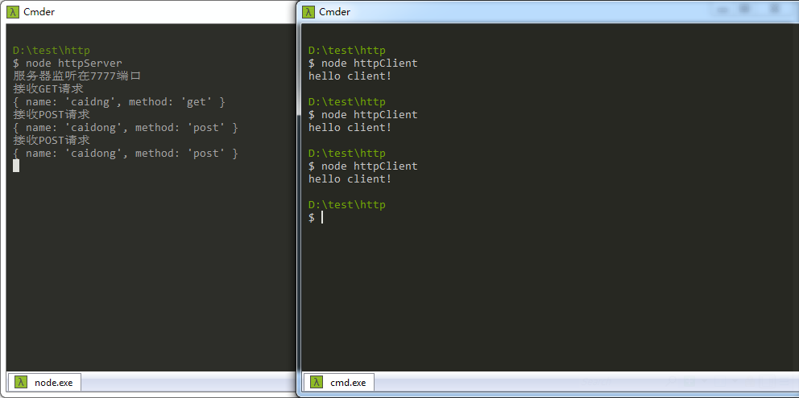
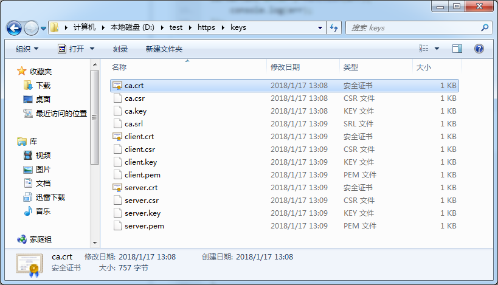
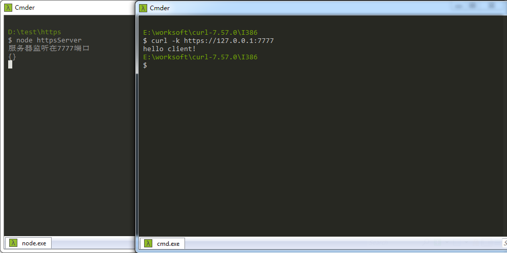
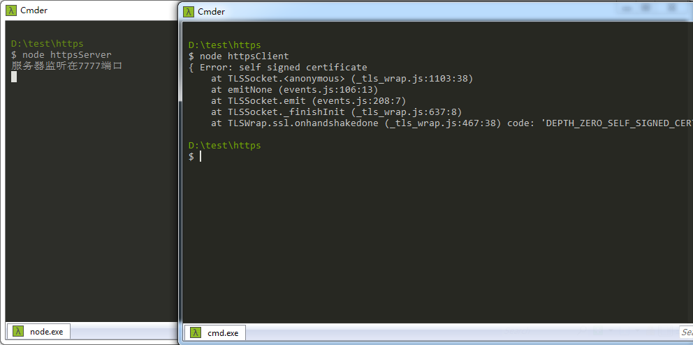
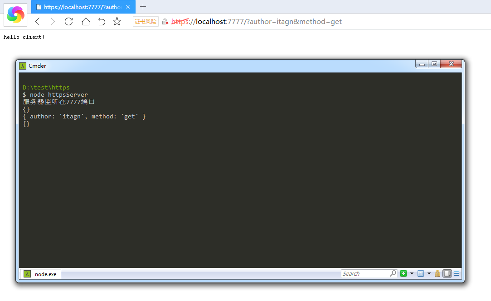

# 原生NodeJS网络编程
本文主要讲解 tcp udp http https 的通信  
来源于《深入浅出Node.js》P151
## 网络七层协议
网络七层协议

    应用层  http smtp
    表示层  加密/解密
    会话层  通信连接
    传输层  tcp udp
    网络层  Ip 路由器
    数据链路层  二层交换机 MAC地址
    物理层  物理硬件设备
    
## TCP

    TCP通过socket来实现服务器与客户端之间的通信，三次握手之后才可以传输数据

TCP三次握手通信简介下

1. 客户端给服务器发送一个SYN=1的数据包
1. 服务器给客户端返回一个SYN/ACK=1的数据包
1. 客户端给服务器返回一个ACK=1的数据包

通过nodejs创建一个**TCP**的服务器
```javascript
var net = require('net');
var server = net.createServer(function(socket){
    //  socket通信，通过事件订阅作为回调函数
    socket.on('data', function(data){
        console.log(data.toString());  //  hello server!
        socket.write('hello client!');
    });
    socket.on('end', function(){
        console.log('这一次的socket通信结束');
    });
});
//  服务器监听端口
server.listen(7777, function(){
    console.log('开始监听7777端口，等待socket通信');
});
server.on('error', function(err){
    console.log(err);
});
```
通过nodejs创建一个**TCP**的客户端
```javascript
var net = require('net');
//  配置如果没有ip地址，就会默认为本地localhost/127.0.0.1
var config = {
    port: 7777,
    host: '127.0.0.1'
}
//  connect函数的参数是 port host? connectHandler?
var client = net.connect(config, function(){
    client.write('hello server!');
});
client.on('data', function(data){
    console.log(data.toString());  //  hello client!
    client.end();
});
client.on('end', function(){
    console.log('这一次的socket通信结束');
});
client.on('error', function(err){
    console.log(err);
});
```
我们可以看到通信结果



## UDP

    UDP也是通过socket来实现服务器与客户端之间的通信，DNS服务是基于UDP实现的

UDP与TCP的区别

1. TCP中一个socket只能和一个TCP服务器通信，UDP中一个socket可以和多个UDP服务器通信
1. TCP传输数据需要建立连接，UDP无需连接
1. TCP是可靠的连接传输，UDP是不可靠的连接传输，网络差会丢包严重

通过nodejs创建一个**UDP**的服务器
```javascript
var dgram = require('dgram');
//  创建udp的socket
var server = dgram.createSocket('udp4');
//  接收消息触发
server.on('message', function(msg, from){
    console.log(msg);  //  <Buffer xx xx xx ...>
    console.log('form '+from.address+':'+from.port);
});
server.on('listening', function(){
    var address = server.address();
    console.log('服务器监听在 '+address.address+':'+address.port);
});
//  绑定socket接收所有往网卡7777端口传输的消息，触发listening事件
server.bind(7777);
server.on('error', function(err){
    console.log(err);
});
```
通过nodejs创建一个**UDP**的客户端
```javascript
var dgram = require('dgram');
//  如果传输的消息不处理成Buffer，也会自动处理成Buffer传输
var message = new Buffer('hello world!');
var client = dgram.createSocket('udp4');
client.send(message, 0, message.length, 7777, '127.0.0.1', function(err, bytes){
    if(err){
        console.log(err);
    }
    client.close();
});
```
我们可以看到通信结果



## HTTP

    http是应用层的协议，tcp和udp是传输层的协议
    http协议是构建在tcp协议之上
    广泛应用于服务器和浏览器，即B/S架构
    http是请求响应式的，一次请求一次响应
    
HTTP与TCP的区别

1. http拥有keepalive后，一个tcp的会话可以用于多次请求和响应，且能实现高并发
1. tcp服务以connection为单位，http服务以request为单位

通过nodejs创建一个**HTTP**的服务器
```javascript
var http = require('http');
var url = require("url");  //解析GET请求
var server = http.createServer(function(req, res){
	var msg;
	if(req.method === 'GET'){
		console.log('接收GET请求');
		//  get方式传递的值是添加在url后面，所以解析url就可以获取数据了
		msg = url.parse(req.url, true).query;
		console.log(msg);
	}else if(req.method === 'POST'){
		console.log('接收POST请求');
		var data = '';
		req.on('data', function(chunk){
			data += chunk;
		});
		req.on('end', function(){
		    //  接收到的data是json字符串，转换成原来的数据（对象）
			msg = JSON.parse(data);
			console.log(msg);
		});
	}
	res.writeHead(200, {'Content-Type': 'text/json'}); 
    res.end('hello client!');
});
server.listen(7777, function(){
    console.log('服务器监听在7777端口');
});
server.on('error', function(err){
    console.log(err);
});
```
通过nodejs创建一个**HTTP**的客户端
```javascript
var http = require('http');
var getConfig = {
    hostname: '127.0.0.1',
    port: 7777,
    path: '/?author=itagn&method=get',
    method: 'GET'
}
var postConfig = {
    hostname: '127.0.0.1',
    port: 7777,
    path: '/',
    method: 'POST'
}
var request = http.request(Math.random()>=0.5 ? getConfig : postConfig, function(res){
	res.setEncoding('utf8');
	res.on('data', function(data){
		console.log(data);  //  服务器的响应
	});
});
var message = JSON.stringify({
      "author": "itagn",
      "method": "post"
    });
request.write(message);
request.end();
request.on('error', function(err){
    console.log(err);
});
```
我们可以看到通信结果



## HTTPS

    HTTPS = HTTP + SSL/TLS
    由于https就是基于http的协议，所以处理请求和响应的时候是相同的
    只是配置文件多了密钥和数字证书

node通过openssl实现的TLS/SSL，过程中生成的证书较多，可以创建文件夹来保存
```javascript
$ mkdir keys && cd keys
```
生成CA证书【遇到填空，可以百度查询填写，或者懒人法：enter到底】
```javascript
$ openssl genrsa -out ca.key 1024
$ openssl req -new -key ca.key -out ca.csr
$ openssl x509 -req -in ca.csr -signkey ca.key -out ca.crt
```
生成服务器私钥、公钥、CSR文件、证书
```javascript
$ openssl genrsa -out server.key 1024
$ openssl rsa -in server.key -pubout -out server.pem
$ openssl req -new -key server.key -out server.csr
$ openssl x509 -req -CA ca.crt -CAkey ca.key -CAcreateserial -in server.csr -out server.crt
```
生成客户端私钥、公钥、CSR文件、证书
```javascript
$ openssl genrsa -out client.key 1024
$ openssl rsa -in client.key -pubout -out client.pem
$ openssl req -new -key client.key -out client.csr
$ openssl x509 -req -CA ca.crt -CAkey ca.key -CAcreateserial -in client.csr -out client.crt
```
可以看到生成了很多文件



通过nodejs创建一个**HTTPS**的服务器
```javascript
var https = require('https');
var url = require('url');
var fs = require('fs');
var config = {
    key: fs.readFileSync('./keys/server.key'),
    cert: fs.readFileSync('./keys/server.crt')
}
var server = https.createServer(config, function(req, res){
    var msg = url.parse(req.url, true).query;
    console.log(msg);
    res.writeHead(200, {'Content-Type': 'text/plain'});
    res.end('hello client!');
});
server.listen(7777, function(){
    console.log('服务器监听在7777端口');
});
server.on('error', function(err){
    console.log(err);
});
```
启动服务器后通过curl进行测试
```javascript
$ curl -k https://127.0.0.1:7777
hello client!
```



通过nodejs创建一个**HTTPS**的客户端
```javascript
var https = require('https');
var fs = require('fs');
var config = {
    hostname: '127.0.0.1',
    port: 7777,
    path: '/?author=itagn&method=get',
    method: 'GET',
    key: fs.readFileSync('./keys/client.key'),
    cert: fs.readFileSync('./keys/client.crt'),
    ca: [fs.readFileSync('./keys/ca.crt')]
}
config.agent = new https.Agent(config);
var request = https.request(config, function(res){
    res.setEncoding('utf-8');
    res.on('data', function(data){
        console.log(data);
    });
});
request.end();
request.on('error', function(err){
    console.log(err);
});
```
我们可以看到通信结果，本地使用https似乎有些问题



浏览器可以通信，访问一次但是请求了两次，打开审查元素发现，浏览器除了第一次访问路径，还请求了一次favicon.ico，导致服务器接收到两次请求



作者：微博 [@itagn][1] - Github [@itagn][2]

[1]: https://weibo.com/p/1005053782707172
[2]: https://github.com/itagn
