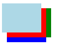

# 纯CSS实现canvas的像素动画
像素动画在前端可视化中的需求越来越频繁了，通过canvas来实现像素动画显得非常酷炫，如果不使用JavaScript能实现这样的动画吗？作者本人很喜欢像素动画特效，那么我们来看看怎么实现的吧。    
[【预览 纯CSS实现canvas的像素动画 实例】](https://itagn.github.io/ui/boxShadow/)
## box-shadow
制作像素动画需要构建组成这个图形的所有小方块吧，如果一个像素对应一个div，那么不管从整体布局还是动画的过渡来都是工作量很大的事，有没有办法一个div就能解决呢？   
是可以的，css3的`box-shadow`就可以这么玩，我们先看看`box-shadow`是怎么使用的吧！   
`box-shadow`

    box-shadow: x-shadow, y-shadow, z-shadow, size, inset;
    x-shadow 为水平阴影的位置
    y-shadow 为垂直阴影的位置
    z-shadow 为模糊距离
    size 为阴影的尺寸
    inset 把外部阴影换成内部阴影

最厉害的是，可以同时添加N个阴影，这也是本次动画的核心原理，怎么使用的呢，看代码以及效果图    
```css
.demo {
    width: 80px;
    height: 60px;
    background-color: lightblue;
    box-shadow:
        1px 1px 0 0 red,
        1px 2px 0 0 blue,
        2px 1px 0 0 green
    ;
}
```

    

## 像素动画剖析
制作像素动画需要解决   

- 1.实现像素图形的构建和布局
- 2.实现像素图形之间的转换动画

第一点我们可以通过`box-shadow`来解决，因为我们设置一个长宽为1em的div，阴影在不改变尺寸的情况下都是长宽为1em，通过阴影的水平偏移和垂直偏移来实现布局。

第二点就是我们css3常用的`animation`来实现动画的制作了，通过不同时间段来制作不同图形的阴影，达到动画的视觉冲突。    

需要注意的是，由于dom只有一个长宽为1em的div，所以在布局居中的时候有可能会发现明显的不居中，因为阴影是不占据div的大小的，所以为了保证完美居中，我们需要设置 `margin: ${y/2} ${x/2};`     

至于为什么使用 em 作为构建像素尺寸和位置的单位呢？    

- 1.为了更加方便的兼容不同屏幕大小的浏览器
- 2.为了更加方便的维护，如果发现整体的尺寸小了或者大了，我们只需要通过 `font-size: ${n}px;` 来实现，否则不仅需要修改div的大小，布局也需要相同倍率的修改，极大的减少所有的工作量

## 总结
一起来用css做一些有趣的事吧

作者：微博 [@itagn][1] - Github [@itagn][2]

[1]: https://weibo.com/p/1005053782707172
[2]: https://github.com/itagn


