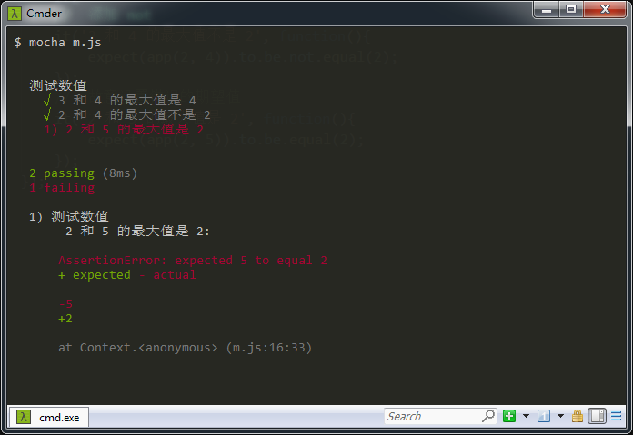
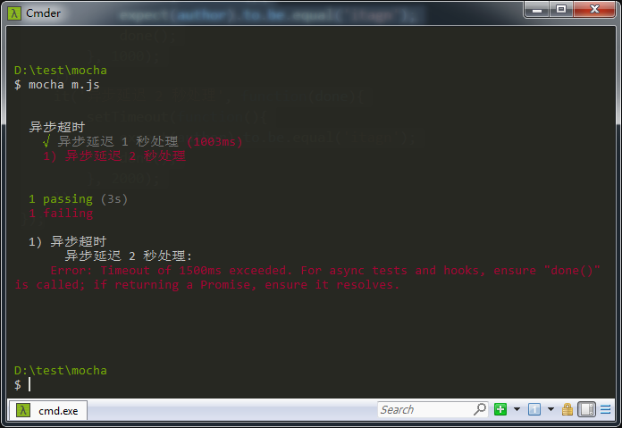
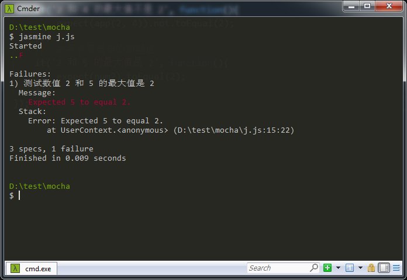
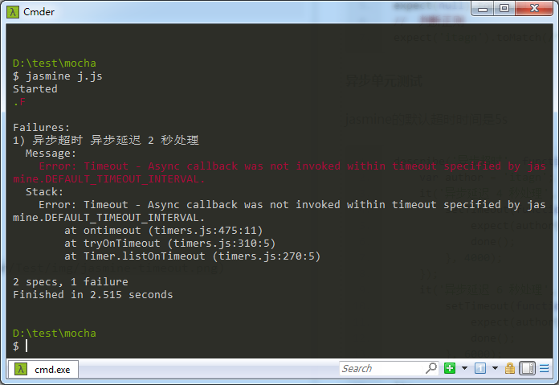

# 用Mocha和Jasmine进行单元测试
本文从博客[【测试框架 Mocha 实例教程】](http://www.ruanyifeng.com/blog/2015/12/a-mocha-tutorial-of-examples.html)与 博客[【Jasmine中文指南】](https://yq.aliyun.com/articles/53426)，以及《深入浅出Node.js》学习  
## mocha和jasmine初印象
mocha和jasmine都是优秀的测试框架，你可以从本文中看到他们在单元测试方面的异同

    JavaScript是脚本语言，所以可以写测试工具
     测试风格分BDD（行为驱动开发）和TDD（测试驱动开发），区别:
    > 关注点。BDD关注整体行为是否和预期相同。TDD关注所有功能是否正确实现。
    > 表达方式。BDD接近自然语言。TDD接近功能说明书。
    本文主要是BDD测试风格
    
    第一次见到Mocha是在一个nodejs的项目上，感觉灰常高大上
    第一次见到Jasmine是在vue的文档【单元测试】模块，后来得知浏览器端Jasmine是非常火的
    好在两者之间的语法大同小异，学习成本低
    了解了几篇相关博客内容，来记录如何写单元测试吧
    本文主要讲解单元测试，测试框架如下
    > Mocha
    > Jasmine

## Mocha
首先当然是安装了
```javascript
$ npm i -g mocha
```
还需要安装断言库，本文选择使用 chai
```javascript
$ npm i chai
```
如何写测试文件呢，假设测试app.js文件，要测试app.js输出结果是否符合预期
```javascript
//  app.js
function maxNum(a, b){
    return Math.max(a, b);
}
module.exports = maxNum;
```
我们测试这个函数是否是符合预期，那么创建脚本 m.js，然后执行 mocha m.js
```javascript
//  m.js
var app = require('./app.js');
var chai = require('chai');
var expect = chai.expect;
//  describe 和 it 是全局函数，describe代表一组相关测试集，it代表一个测试用例
describe('测试数值', function(){
    it('3 和 4 的最大值是 4', function(){
        expect(app(3, 4)).to.be.equal(4);
    });
    //  添加 not
    it('2 和 4 的最大值不是 2', function(){
        expect(app(2, 4)).to.be.not.equal(2);
    });
    //  故意设置错误的期望值
    it('2 和 5 的最大值是 2', function(){
        expect(app(2, 5)).to.be.equal(2);
    });
});
```
可以看到效果如下
    
    第一个测试用例通过了passing
    第二个测试用例通过了passing
    第三个测试用例失败falling，显示预期值2和输出结果5不相等，并说明问题出现在test.js的第16行



mocha的规则知道了，那么简单看看mocha的其他api是怎么使用的吧，其他的api不举例了，详情去[【Mocha官网】]()看api
```javascript
//  判断是否可以转化为true和false
expect(true).to.be.ok;
expect(false).to.be.not.ok;
//  判断类型
expect('itagn').to.be.a('string');
expect({}).to.be.an('object');
expect([]).to.be.an.instanceof(Array);
//  判断正则
expect('itagn').to.match(/^i/);
```
**异步单元测试**

mocha的默认超时时间是2秒，通过this.timeout可以修改超时时间
```javascript
var chai = require('chai');
var expect = chai.expect;
describe('异步超时', function(){
    var author = 'itagn';
    it('异步延迟 1 秒处理', function(done){
        this.timeout(1500);
        setTimeout(function(){
            expect(author).to.be.equal('itagn');
            done();
        }, 1000);
    });
    it('异步延迟 2 秒处理', function(done){
        this.timeout(1500);
        setTimeout(function(){
            expect(author).to.be.equal('itagn');
            done();
        }, 2000);
    });
});
```  
测试结果如下



## Jasmine
```javascript
$ npm i -g jasmine
```
jasmine不依赖其他库，describe、it、expect都是全局函数  
所以不像mocha需要安装其他的断言库      
同样测试之前的app.js，创建脚本 j.js，然后执行 jasmine j.js
```javascript
// j.js
var app = require('./app.js');
//  describe it expect 是全局函数，describe代表一组相关测试集，it代表一个测试用例
describe('测试数值', function(){
    var num1 = app(3, 4), num2 = app(2, 5);
    it('3 和 4 的最大值是 4', function(){
        expect(num1).toEqual(4);
    });
    //  添加 not
    it('2 和 4 的最大值不是 2', function(){
        expect(app(2, 4)).not.toEqual(2);
    });
    //  故意设置错误的期望值
    it('2 和 5 的最大值是 2', function(){
        expect(num2).toEqual(2);
    });
});
```
可以看到效果如下
    
    第一个测试用例通过了显示.
    第二个测试用例通过了显示.
    第三个测试用例失败显示F，显示预期值2和输出结果5不相等，并说明问题出现在test.js的第15行



简单看看jasmine的其他api是怎么使用的吧，其他的api不举例了，详情去[【Jasmine官网】](https://jasmine.github.io/api/2.9/global)看api
```javascript
//  判断是否可以转化为true和false
expect(true).toBeTruthy();
expect(false).toBeFalsy();
//  判断是否为空
expect(null).toBeNull();
//  判断正则
expect('itagn').toMatch(/^i/);
```
**异步单元测试**  
jasmine的默认超时时间是5s，通过jasmine.DEFAULT_TIMEOUT_INTERVAL来修改超时时间
```javascript
describe('异步超时', function(){
    beforeEach(function(){
        jasmine.DEFAULT_TIMEOUT_INTERVAL = 1500;
    });
    var author = 'itagn';
    it('异步延迟 1 秒处理', function(done){
        setTimeout(function(){
            expect(author).toEqual('itagn');
            done();
        }, 1000);
    });
    it('异步延迟 2 秒处理', function(done){
        setTimeout(function(){
            expect(author).toEqual('itagn');
            done();
        }, 2000);
    });
});
```  
测试结果如下



## 总结
还有很多api没有讲，本文主要是简单的介绍两个测试框架在普通测试和异步测试

1. 两个都是BDD的风格，所以语法很像，用来写单元测试
1. Mocha没有断言库，可以灵活的自由搭配，Jasmine自带了断言库
1. Jasmine简化了一些可以合并的链式
1. Mocha可以直接在nodejs和浏览器进行测试，Jasmine需要安装jasmine-node包


作者：微博 [@itagn][1] - Github [@itagn][2]

[1]: https://weibo.com/p/1005053782707172
[2]: https://github.com/itagn


