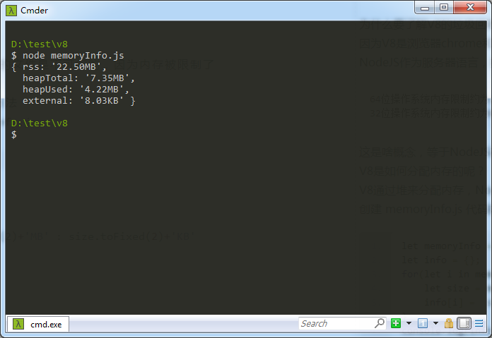

# V8的垃圾回收机制
## 了解V8
为什么要了解V8的垃圾回收机制呢？  
因为V8是浏览器chrome和NodeJS的运行JavaScript的引擎，了解v8就能够更加清楚的掌握JavaScript。  
NodeJS作为服务器语言，操作文件是太常见了，然而NodeJS使用内存的时候，是有内存限制的。  

    64位操作系统内存限制约为1.4GB
    32位操作系统内存限制约为0.7GB

这是啥概念，等于NodeJS在内存中用V8操作2GB的文件是有问题的，因为内存被限制了。  
V8是如何分配内存的呢？  
V8通过堆来分配内存，NodeJS也提供了查询内存信息的方法。  
创建  memoryInfo.js  代码如下，执行  node memoryInfo.js
```javascript
let memoryInfo = process.memoryUsage();
let info = {};
for(let i in memoryInfo){
    let size = memoryInfo[i]/1024;
    info[i] =  size > 1024 ?  (size/1024).toFixed(2)+'MB' : size.toFixed(2)+'KB'
}
console.log(info);
```
我们可以看到输出了一个包含内存使用情况的对象，之前说了V8是通过堆分配内存的。  
这里面heapTotal就是V8的申请到的堆内存大小，heapUsed就是V8当前使用的堆内存大小。  



之前说到了V8限制了内存大小，当然也可以手动打开，在执行node命令时。
```javascript
//  分配老生代，单位为MB
$ node --max-old-space-size=1024  memoryInfo.js
//  分配新生代，单位为KB
$ node --max-new-space-size=1024  memoryInfo.js
```
参数在V8初始化时生效，不能动态的改动，可以通过这个放宽V8的内存限制，解决一些内存无法缩小的情况  
这里提到了老生代和新生代，那什么是老生代和新生代呢？
虽说V8是通过堆分配来内存的，但是为了更好的垃圾回收，内存被分为了老生代和新生代

    老生代：生命周期较长或者常驻的对象
    新生代：生命周期较短的对象

由于老生代长期不会被回收，所以积累越来越多，分配给老生代的内存也就更大。  
新生代变量短期就会被释放，消费的快，积累的很少，分配给新生代的内存也就更小。  
所以上面释放内存限制的代码，释放内存大小的单位是不一样的。  

## 新生代的垃圾回收机制
之前说到了新生代和老生代是根据特点区分出来的，所以垃圾回收机制算法也是针对性的。  
新生代使用Scavenge算法进行垃圾回收，那什么是Scavenge算法呢？  
Scavenge算法：核心采用了Cheney算法。  
这里先介绍Cheney算法：采用复制的方式实现的垃圾回收算法。
    
    把堆内存一分为二，每部分空间成为semispace。
    两个semispace空间中。只有一个处于使用中（称为From空间），一个处于闲置状态（称为To空间）。
    分配对象时，从From空间进行分配。
    垃圾回收时，检查From空间的存活对象，存活对象被复制到To空间中，不存活的对象占用空间被释放。
    复制完成后，From空间的对象和To空间的对象进行对换。

Scavenge算法的改动：增加了“晋升”过程

    当一个对象复制多次仍然存活，会被认为是一个生命周期较长的对象。
    生命周期较长的对象就会被移动到老生代中。

触发晋升的条件： 

1. 对象是否经历了Scavenge算法
1. To空间内存占比超过了25%

Scavenge算法的优点：

1. 只复制存活的对象，在新生代中相比生命周期较长的对象占比很小，时间上效率高。
1. 非常适用于新生代中。

Scavenge算法的缺点：

1. 只能使用新生代堆内存的一半，因为分为了两个等同的semispace空间。
1. 牺牲空间换时间的算法，无法大规模的应用到所有的垃圾回收机制中。


那么V8堆内存的大小就是，两个semispace空间的大小和老生代的内存大小。
## 老生代的垃圾回收机制
上面发现了Scavenge算法的缺点，老生代分配的空间很大，且算法通过复制的存活对象，而老生代的特点导致存活对象是很大一部分，效率非常低，不适用Scavenge算法进行垃圾回收。  
采用了Mark-Sweep算法进行垃圾回收。  
Mark-Sweep算法分为了标记和清除两个阶段。

    标记阶段：Mark-Sweep遍历老生代中所有对象，标记存活的对象。
    清除阶段：Mark-Sweep清除没有被标记的对象。
    
Mark-Sweep算法的优点：

1. 老生代中死亡对象占比很低，通过操作死亡对象，能和Scavenge一样高效率的进行垃圾回收。
1. 不需要浪费空间，高效率的解决垃圾回收，适用于老生代。

Mark-Sweep算法的缺点：

1. 进行垃圾回收后，内存空间会出现大量不连续空间的情况。
1. 分配大内存对象的时候，碎片空间大小如果不够，会提前触发垃圾回收，这次回收是不必要的。

为了解决Mark-Sweep算法的缺点，增加了Mark-Compact算法进行辅助。

    标记存活对象后，活着的对象会往一端移动，移动完成后，清理掉存活对象边界外的内存。

Mark-Compact算法的优点：

1. 解决了Mark-Sweep算法的缺点。
1. 空间利用更合理。

Mark-Compact算法的缺点：

1. 需要移动对象，所以速度会变慢。

Mark-Sweep算法的高效率和Mark-Compact算法合理分配空间，所以结合了Mark-Sweep和Mark-Compact算法进行老生代的内存管理。

    进行老生代垃圾回收时，使用Mark-Sweep算法进行垃圾回收。
    如果空间不足跟配新生代晋升过来的大对象时，使用Mark-Compact算法进行垃圾回收。

## 其他经验
之前说到了V8内存限制的问题，NodeJS不能操作2GB的文件了吗？答案当然是能操作了。  
使用堆分配的内存大小是有限制的，但是我们可以操作大文件不使用堆分配。  
使用Buffer对象操作文件和数据流方法，就会通过其他方式分配内存，突破内存限制。  
V8使用堆内存读写文件
```javascript
const fs = require('fs');
let rd = fs.readFile('rd.txt', (err, data) => {
    fs.writeFileSync('wt.txt', data);
});
```
使用读写数据流，突破内存限制的读写文件
```javascript
const fs = require('fs');
let rd = fs.createReadStream('rd.txt');
let wt = fs.createWriteStream('wt.txt');
rd.pipe(wt);
```
为了避免影响垃圾回收，我们在写JavaScript时注意避免内存泄漏，而闭包很容易导致内存泄漏。  
闭包变量使用完后，如果不能被垃圾回收机制清理，我们可以手动清理。
```javascript
let fn = function (){
    let dom = document.querySelect('.main');
    return function (){
        //  这里出发了内存泄漏
        console.log(dom);
        //  消除引用，手动解决垃圾回收机制会清理内存
        dom = null;
    }
}
fn()();
```

作者：微博 [@itagn][1] - Github [@itagn][2]

[1]: https://weibo.com/p/1005053782707172
[2]: https://github.com/itagn
